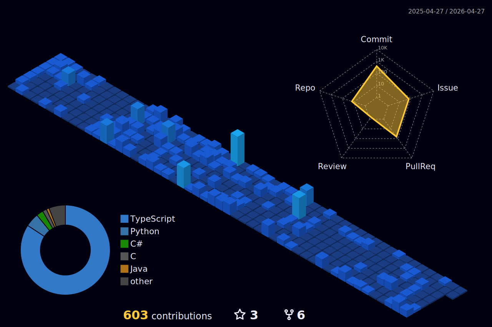

- 👋 Hi, I’m @cmac2112, Software Developer at INTRUST Bank specializing in .NET/c#/blazor/sql work.
- 👀 My Experience: Software Developer @ INTRUST Bank, Front-End Software Engineer Intern @ Legget & Platt, Software Developer/IMS Technician @ Bethel College
- 🌱 Leadership: President of Bethel's Inagural Software Club mentoring CS students at Bethel building projects, preparing for interviews, and representing Bethel College at Hackathons in the area.
- 🔨 Currently Working on: My personal website, developing the worst chess ai ever, and some other things listed variously throughout my repositories.
- 📫 How to reach me: Twitter @mac2112. Email: Caden.mcarthur@gmail.com Linkedin https://www.linkedin.com/in/cadenmcarthur/

- Awards: NASA Space Apps Challenge Local Impact Award, NASA Space Apps Challenge People's Choice Award, Most Promising New Student Organization

- <b> All Archived projects are retired and no longer are being considered to be iterated upon, these projects are old and are a testament to the learning i have undertaken over the past several years of building things. It is not uncommon to see weird decisions and mistakes in these repos. All I ask for is a little mercy on my past sweet little innocent college soul who did not know much at the time </b> :)

- 
- 
- 
- 

<!---
cmac2112/cmac2112 is a ✨ special ✨ repository because its `README.md` (this file) appears on your GitHub profile.
You can click the Preview link to take a look at your changes.
-   
- 
--->
