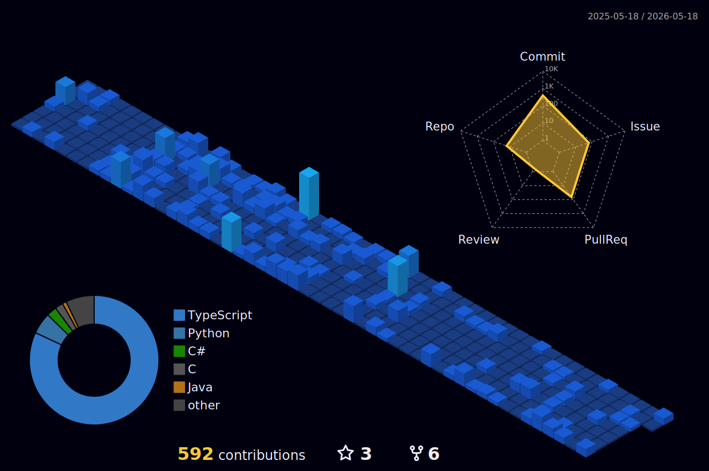

- 👋 Hi, I’m @cmac2112, Software Egnineer with a myriad of experience with different languages and frameworks
- 👀 My Experience: Full time software roles at banks building wealth investment apps supporting client assets up to $9 Billion, and internship experience with large global corperations
- 🌱 Leadership: Founded Bethel's Inagural Software Club representing Bethel College at Hackathons in the area.
  Linked in: https://www.linkedin.com/in/cadenmcarthur/
  Personal Website (WIP): https://personalwebsite-ekvj.onrender.com/

- Awards: NASA Space Apps Challenge Local Impact Award, NASA Space Apps Challenge People's Choice Award, Most Promising New Student Organization

- 
- 
- 
- 

<!---
cmac2112/cmac2112 is a ✨ special ✨ repository because its `README.md` (this file) appears on your GitHub profile.
You can click the Preview link to take a look at your changes.
-   
- 
--->
